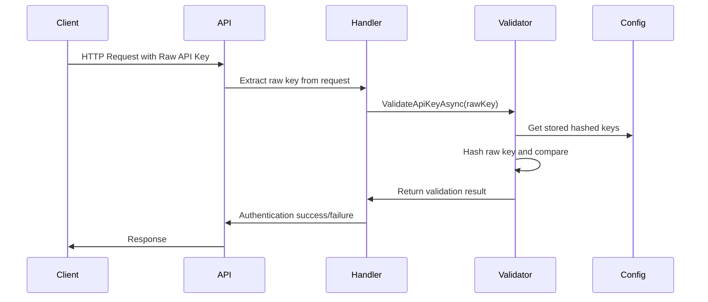

# Edi.AspNetCore.ApiKeyAuth

A simple and flexible API Key authentication library for ASP.NET Core applications.

## Features

- 🔑 API Key authentication via headers or query parameters
- 🏗️ Easy integration with ASP.NET Core's authentication system
- ⚙️ Configurable API keys through `appsettings.json`
- 📊 Built-in logging support
- 🎯 Multiple .NET versions support (.NET 8.0 and .NET 9.0)



## Installation

Install the package via NuGet:

```bash
dotnet add package Edi.AspNetCore.ApiKeyAuth
```

Or via Package Manager Console:

```powershell
Install-Package Edi.AspNetCore.ApiKeyAuth
```

## Quick Start

### 1. Configure API Keys

Add your API keys to `appsettings.json`:

```json
{
  "ApiKeys": [
    {
      "Identifier": "MyApp",
      "HashedKey": "generated-hash",
      "Roles": ["Admin", "User"],
      "Scopes": ["read", "write"],
      "IsActive": true,
      "Description": "Primary application key",
      "ExpiresAt": "2025-12-31T23:59:59Z",
      "RateLimit": {
        "RequestsPerMinute": 60,
        "RequestsPerHour": 1000,
        "RequestsPerDay": 10000
      }
    }
  ]
}
```

### 2. Register Services

In your `Program.cs` or `Startup.cs`:

```csharp
using Edi.AspNetCore.ApiKeyAuth;

var builder = WebApplication.CreateBuilder(args);

// Add API Key authentication
builder.Services.AddApiKeyAuthentication(options =>
{
    options.AllowQueryStringAuth = false; // Disable for security
    options.EnableDetailedLogging = builder.Environment.IsDevelopment();
    options.EnableCaching = true;
});

var app = builder.Build();

// Enable authentication and authorization
app.UseAuthentication();
app.UseAuthorization();

app.Run();
```

### 3. Protect Your Endpoints

Use the `[Authorize]` attribute on controllers or actions:

```csharp
[ApiController]
[Route("api/[controller]")]
[Authorize(AuthenticationSchemes = "ApiKey")]
public class SecureController : ControllerBase
{
    [HttpGet]
    public IActionResult GetData()
    {
        // Access enhanced claims
        var userIdentifier = User.FindFirst("UserIdentifier")?.Value;
        var roles = User.FindAll(ClaimTypes.Role).Select(c => c.Value).ToArray();
        var scopes = User.FindAll("scope").Select(c => c.Value).ToArray();
        
        return Ok(new 
        { 
            User = userIdentifier,
            Roles = roles,
            Scopes = scopes,
            Message = "Hello from secure endpoint!"
        });
    }

    [HttpPost]
    [Authorize(Roles = "Admin")] // Role-based authorization
    public IActionResult AdminOnly()
    {
        return Ok("Admin access granted");
    }
}
```
